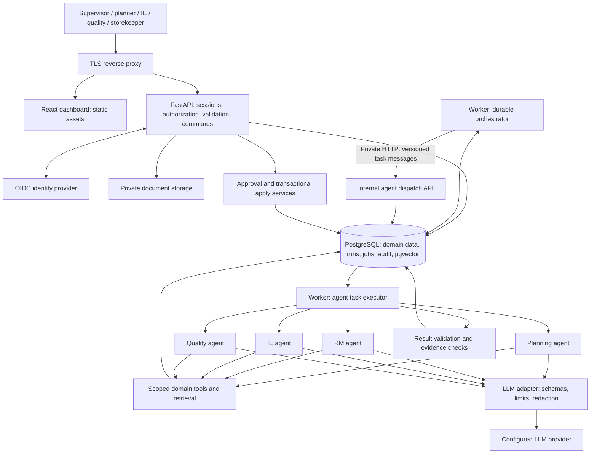

# LineSense AI: architecture and implementation plan

Prepared from the supplied IT 3041 assignment brief and LineSense architecture image, 17 September 2026. This is a proposed build specification, not a claim that the system is already implemented or tested.

## 1. Product, assumptions, and success criteria

Build a factory operations decision-support application for apparel manufacturing. A supervisor should be able to answer: **Can this order finish on time, what is blocking it, what evidence supports that conclusion, and what should we do next?**

Preserve the four functions in the supplied diagram: planning and allocation, supermarket/raw materials (RM), industrial engineering (IE)/cycle time, and quality. Add explicit data ownership, persistent workflows, human approvals, bounded AI tools, and measurable evaluation.

Assumptions to record and confirm during kickoff:

- A 3–4-student team works from assignment Week 3 through Week 10; viva is Week 11. These are assignment-relative weeks, not calendar dates.
- The manufacturing domain still needs confirmation against the lecturer's approved domain list, which was not supplied. The report template was also not supplied.
- The image's “26-customer order book” means 26 customers in the demonstration dataset, not an application limit.
- Initial inputs are synthetic CSV records and text-based PDF/Markdown SOPs. Live ERP/MES access, real worker records, and scanned-document OCR are later integrations.
- One demonstration organization contains two factories so access boundaries can be tested. Organization scoping remains in the schema for future customers.
- English is the initial UI/document language. Store timestamps in UTC and display the factory's configured timezone, initially Asia/Colombo.
- The system recommends actions; it does not operate machinery, place real purchase orders, or authorize physical shipments.

Success means a reproducible deployment, four interacting domain agents, a demonstrable real LLM path, explicit NLP and IR evaluation, secure role-based workflows, and complete assignment evidence. No plan can guarantee zero defects; use the release gates below and report known limitations honestly.

## 2. Assignment traceability

| Brief requirement | Concrete implementation | Evidence for assessment |
|---|---|---|
| At least two interacting intelligent agents | Four domain agents exchanging typed tasks/results through an orchestrated protocol | Run trace showing planning reacting to RM and IE findings |
| LLM use | Tool selection, exception interpretation, grounded action explanations | Redacted real-provider run with model and prompt versions |
| NLP | Entity extraction for order/style/line/material/defect references; exception classification and summarization | Labeled extraction/classification dataset and measured scores |
| Information retrieval | Authorized SOP retrieval using lexical plus vector search, with citations | Lexical/vector/hybrid comparison and Recall@5 |
| Security | OIDC login, server sessions, resource authorization, validated uploads, encrypted transport | Negative access tests, threat model, scan results |
| Defined agent protocol | Versioned JSON messages over private HTTP with durable task IDs | OpenAPI, schemas, sequence diagram, retry demo |
| Responsible AI | Evidence, abstention, worker privacy, review of consequential actions | Model/data cards, adversarial tests, fairness limitations |
| Commercialization | Target factories, proposed tiers, cost model, deployment options | Pricing assumptions and pilot measurement plan |
| Week 6 mid evaluation: 20 marks | Architecture, roles/communication, progress demo, RAI check, business pitch | Slides and a working two-agent vertical slice |
| Week 10 Gen AI video: 25 marks | 3–5-minute explanation using a generative-video tool | Final video with accurate claims and identifiable synthetic scenes |
| Week 10 report: 30 marks | Design, methodology, RAI, commercialization, evaluation | Official template populated with actual results |
| Week 10 repository: 5 marks | Setup, usage, contributors, tests, documentation | Reproducible README and repository |
| Week 11 viva: 20 marks | Each member explains code, decisions, protocols, results | Contribution log and individual rehearsals |

The brief also prohibits plagiarism and unauthorized reuse. Keep dependency licenses, source attribution, and an AI-assistance log according to course policy; every member must understand and be able to explain their contribution.

## 3. Recommended architecture

Use a **modular monolith with a separate worker process**, a React client, and PostgreSQL. Agents are independently specified software components within the backend codebase; they do not each need a deployed microservice.



`API` and `DISPATCH` are the same application with public and private routing boundaries. `W` and `EXEC` are roles of the same worker implementation. The diagram does not imply additional deployed services. Serve `/api` and the frontend under the same browser origin. Block `/internal` at the public proxy and require service authentication as an independent control.

**Boundaries:** the browser cannot access databases, provider keys, or internal agent routes. Agents receive scoped tools, never database credentials. Only domain command services apply approved changes. The LLM is an external data-processing boundary and receives the minimum approved information.

### Improvements over the supplied diagram

| Original ambiguity | Implementation decision |
|---|---|
| Generic planner decides everything | Durable state machine owns workflow; bounded LLM decisions choose among permitted investigative actions |
| Agents may write directly to databases | Read/compute tools for agents; proposals go through validated command services |
| Separate operational and vector databases | PostgreSQL plus pgvector initially; fewer consistency and deployment problems |
| A2A / REST / MCP presented together | Implement and document one HTTP/JSON protocol; do not claim A2A or MCP compliance |
| Single order status mixes several concerns | Separate production, materials, quality, and analysis states |
| Security attached to dashboard | Server authorization applies to API, workers, retrieval, files, and exports |
| Summarizer could invent a status | Canonical structured status first; optional grounded explanation second |
| Missing failure behavior | Durable leases, idempotency, retry limits, stale-result rejection, explicit degraded states |
| ERP connection unspecified | Versioned import contracts and adapter interface; synthetic inputs first |

PostgreSQL/pgvector supports both exact and approximate vector search. Begin with exact search on the small assignment corpus; introduce an approximate index only after measuring retrieval quality and latency. [pgvector documentation](https://github.com/pgvector/pgvector)

## 4. Technology choices and repository

| Layer | Choice | Reason |
|---|---|---|
| Frontend | React, TypeScript strict mode, Vite | Suitable for an authenticated dashboard without a second application server |
| UI | Tailwind CSS, accessible component primitives, React Router | Consistent layout and predictable navigation |
| Server data/forms | TanStack Query, React Hook Form, Zod | Explicit loading/error states and validated forms |
| Charts | Recharts | Capacity, stock coverage, cycle time, and defect charts |
| API | Python, FastAPI, Pydantic | Typed contracts and proximity to NLP/data libraries |
| Persistence | SQLAlchemy, Alembic, PostgreSQL, pgvector | Transactional data, migrations, retrieval, and durable work records |
| Authentication | Keycloak OIDC locally; compatible OIDC provider in deployment | Avoid building password handling and recovery flows |
| OIDC integration | Maintained Python OIDC client such as Authlib | Standards validation; server-side application sessions |
| Background work | PostgreSQL job table and separately run Python worker | One durable dependency at assignment scale |
| AI | One provider SDK behind an `LLMClient` interface | Explicit model, cost, timeout, and schema handling |
| Embeddings/NLP | Small pinned local embedding model; spaCy rules/entity ruler plus explicit classifiers | Reproducible baseline and no external embedding transfer by default |
| Testing | pytest, Hypothesis for core invariants, Vitest, Testing Library, Playwright | Domain, concurrency, component, and real-browser coverage |
| Delivery | Docker Compose, GitHub Actions, Caddy or equivalent TLS proxy | Reproducible local setup and simple deployment |
| Observability | Structured JSON logs, trace IDs, OpenTelemetry instrumentation, basic metrics | Diagnose a run across API, worker, and provider calls |

Select maintained compatible stable versions during bootstrap; record exact versions in lockfiles and image references. Do not copy guessed “latest” versions into manifests. Vite provides a React/TypeScript template and static production build. [Vite guide](https://vite.dev/guide/)

Keycloak is an extra local container for reproducible identity testing; give it a separate database/user. A hosted deployment may use an existing OIDC provider. Production must use production configuration, not Keycloak development mode. [Keycloak container documentation](https://www.keycloak.org/server/containers)

```text
linesense/
  apps/web/src/
    app/ components/ features/ lib/ generated/
  services/backend/
    app/
      api/ auth/ settings/ db/
      domain/{orders,planning,inventory,ie,quality,approvals}/
      agents/{planning,rm,ie,quality}/
      orchestration/ jobs/ retrieval/ nlp/ llm/
      ingestion/ audit/ observability/
    migrations/ tests/
    pyproject.toml
    uv.lock
  contracts/                 # Exported OpenAPI, JSON schemas, protocol examples
  data/{synthetic,fixtures,eval}/
  docs/{adr,architecture,security,evaluation,assessment}/
  infra/{compose,identity,proxy}/
  scripts/
  .github/workflows/
  .env.example
  Makefile
  README.md
  docs/development-guide.md
```

Backend Pydantic/OpenAPI definitions own the wire contract. Generate the TypeScript API client; CI detects drift. Do not maintain unrelated handwritten versions of the same API types. Start without Kafka, Redis, Kubernetes, a separate vector database, fine-tuning, multiple orchestration frameworks, or autonomous browser tools.

## 5. Data model and invariants

Use UUID identifiers, explicit units, decimal quantities, foreign keys, UTC timestamps, and `version` fields for mutable business records. Tenant-owned records carry `organization_id`; plant-specific records also carry `factory_id`. Use composite foreign keys where needed to prevent cross-organization references.

| Domain | Main records | Essential constraints |
|---|---|---|
| Identity | organizations, factories, users, memberships, role_assignments, sessions | Membership is server managed; identity issuer + subject is unique |
| Demand | customers, styles, style_operations, orders, order_items, BOM_versions | Quantity > 0; active BOM/SAM versions; supported units |
| Capacity | lines, capabilities, shift_calendars, line_capacity_slots, allocations | Skill/machine compatibility; no oversubscribed line/date/shift |
| Inventory | materials, lots, stock_movements, reservations, expected_receipts | Ledger-derived balance; accepted stock only; no double reservation |
| IE | operator_aliases, skill_records, cycle_observations, line_measurements | Positive times; sample counts; approved outlier handling |
| Quality | inspections, defect_observations, quality_policy_versions, quality_releases | Defects and defective units distinct; approved policy provenance |
| Documents | documents, document_versions, chunks, embeddings, document_acl | Immutable versions; hash; page/section citation; access scope |
| Workflow | runs, run_snapshots, agent_tasks, agent_results, run_events | Durable status; bounded attempts; input version checks |
| Decisions | recommendations, approvals, approval_items | Exact proposal hash; proposer/approver separation; expiry |
| Operations | audit_events, import_batches, import_errors, notifications | Provenance, idempotency, append-only application audit writes |

Inventory receipts, issues, and corrections are ledger entries; corrections reference the original entry. Replenishment recommendations do not increase stock. Expected receipts count toward projected coverage only, not current availability.

At proposal application, lock affected capacity-slot and material-balance/reservation rows in deterministic order, re-read current values, revalidate constraints, and commit the update, audit event, and follow-up job atomically. Retry transaction conflicts with a bound. Optimistic order versions alone cannot prevent two different orders from consuming the same remaining capacity.

Index organization/factory + common filters, order due date, material/lot, task status/availability, and document ACL/version. Paginate list endpoints. Avoid full event sourcing: ordinary tables, a stock ledger, and an audit log are sufficient.

### State design

- Production lifecycle: `DRAFT -> VALIDATED -> PLANNED -> IN_PRODUCTION -> PRODUCTION_COMPLETE -> DISPATCHED`; cancellation has explicit permitted transitions.
- Materials: `UNKNOWN | READY | AT_RISK | SHORTAGE`.
- Quality: `NOT_INSPECTED | PENDING | HOLD | RELEASED`.
- Analysis: `QUEUED | RUNNING | AWAITING_REVIEW | COMPLETED | DEGRADED | FAILED | CANCELLED`.
- Recommendation: `DRAFT | PROPOSED | APPROVED | REJECTED | EXPIRED | APPLIED | SUPERSEDED`.

`shipment_ready` is a derived eligibility value: production complete, required current inspections satisfied, no active hold, required packing/quantity records complete, and an authorized quality release recorded. It is not an LLM-selected label. Dispatch remains a separate human-recorded event.

Define every transition in a central policy table with actor permissions, preconditions, and audit requirements. No arbitrary `PATCH status` endpoint.

## 6. Four domain agents and bounded autonomy

Each agent has a role prompt, goal, input/output schemas, specific tools, memory scoped to the current run, and a bounded observe–choose tool–evaluate loop. At least planning and RM must demonstrate a real model selecting tools or revising an action based on another agent's result. Merely running four calculators and adding a final summary is not enough evidence of agentic behavior.

The orchestrator enforces the graph and action policy; it can route based on validated agent requests. A model cannot create new permissions or unbounded recursive tasks.

| Agent | Read/compute tools | Output | Human boundary |
|---|---|---|---|
| Planning | Read due dates/BOM, compatible lines, remaining shifts; simulate allocations; inspect RM/IE results | Ranked feasible proposals, unscheduled quantities, conflicts, rationale | Planner proposes; supervisor approves a changed allocation |
| RM / supermarket | Read accepted balances/reservations, BOM demand, consumption history, receipts; retrieve SOP | Time-phased shortages, coverage, replenishment proposal, missing evidence | Storekeeper verifies entries; supervisor approves material-impacting changes |
| IE / cycle time | Read pseudonymous observations, operation staffing, SAM versions; calculate bottlenecks; retrieve IE SOP | Bottleneck operations, capacity estimates, sample limitations, change proposals | IE engineer validates changed operating assumptions |
| Quality | Read inspections/defects, retrieve applicable policy, compare against approved numeric rules | Policy eligibility result, hold reasons, defect trends, cited explanation | Quality manager records release after current-data checks |

No agent sends supplier messages, changes worker assignments, purchases materials, or releases shipments autonomously. Notifications in the assignment are in-app records.

Initial run limits: up to 4 tool calls per agent invocation, 12 model calls across the full run including repair calls, 1 replan, 2 retryable task attempts after the initial attempt, and a configurable total wall-clock/token budget. Reserve limits atomically before calls so concurrent tasks cannot exceed them. A run exits with a clear reason when any limit is reached.

### Deterministic engineering calculations

These are proposed demonstration formulas. An IE/domain owner must validate production assumptions before real use; units and assumptions appear next to every result.

**Planning:**

```text
required_standard_minutes = remaining_units * SAM_minutes_per_unit
available_standard_minutes =
    sum(available_operator_minutes_per_shift * planned_efficiency_fraction)
utilization = allocated_standard_minutes / available_standard_minutes
```

Account for planned breaks, absence, setup/changeover, existing allocations, due-date cutoffs, line capabilities, and factory calendars. Efficiency is applied once. Start with deterministic earliest-due-date allocation and explain tie-breaking. Allocate standard minutes into compatible time slots; use a resource-limited optimizer only if the baseline demonstrably fails. An infeasible order stays unscheduled with a reason.

**Materials:**

```text
available_now = accepted_on_hand - active_reservations
gross_demand = planned_units * BOM_quantity_per_unit * (1 + wastage_fraction)
projected_balance(t) = available_now + eligible_receipts_by(t) - new_demand_by(t)
reorder_point = expected_daily_consumption * lead_time_days + safety_stock
```

Keep consumption forecasts separate from committed demand. Do not subtract existing reservations again when already excluded from available stock. BOM units must convert through explicit approved conversion rules. Missing or zero consumption yields an unknown/unbounded coverage indicator with an explanation, never division by zero or a misleading zero-day value.

**IE:** for the demo's sequential-operation model, compute an effective cycle time for each operation as representative single-operator seconds per unit divided by the number of equivalently capable parallel operators. Bottleneck effective cycle is the maximum; estimated line units per hour is `3600 / bottleneck_effective_cycle_seconds`. State the assumptions: steady flow, comparable operators, no unmodeled machine/material limit. A simple line-balance index is `sum(effective_operation_cycles) / (operation_count * bottleneck_effective_cycle) * 100`; label it as that model's index, not a universal industrial KPI. Compare observed throughput and SAM-based capacity separately; do not silently mix seconds and minutes or apply efficiency twice.

**Quality:** report `defective_units / inspected_units` separately from `total_defects / inspected_units * 100` (DHU). Zero inspections means unknown, not pass. Use a versioned approved policy with sample size, severity categories, acceptance numbers, and required inspections. Any simplified synthetic policy must be labeled “demo policy”; do not claim certified AQL/ISO compliance. The LLM may explain a rule result but cannot invent its thresholds.

Independent reference fixtures to implement before agent prompts:

| Fixture | Expected result |
|---|---|
| 1,000 units at SAM 12 minutes; 20 operators, 420 available minutes each, 75% efficiency | Demand 12,000 standard minutes; one-shift capacity 6,300; cannot fit in one shift |
| 1,500 accepted meters, 400 already reserved; new demand 1,000 units at 1.2 meters with 5% wastage; no incoming receipt | Available 1,100 meters; new demand 1,260; shortage 160 meters |
| Three sequential effective operation cycles of 40, 60, and 50 seconds | Bottleneck 60 seconds; theoretical output 60 units/hour; model-specific balance index approximately 83.33% |
| 100 inspected units, 7 defective units, 12 total defects | Defective rate 7%; DHU 12; disposition depends on the applicable approved policy |
| Two simultaneous requests each reserving 80 units from 100 available | At most one full reservation succeeds; the other receives a conflict/shortage |
| Proposal depends on stock version 4; stock changes to version 5 before application | Application rejected as stale; approval cannot bypass reanalysis |

Document rounding rules: retain decimal precision internally, round displays separately, and round purchasable/allocatable quantities only according to explicit unit and pack-size rules.

## 7. Orchestration, protocol, and recovery

### End-to-end run

1. A permitted user requests analysis with an idempotency key and expected order version.
2. The API checks scope, validates required data, records the input versions/snapshot, creates a run and initial job in one transaction, and returns `202` with `run_id`.
3. The worker claims a short-lived lease, commits the claim, and runs outside a database transaction. It must not hold row locks during LLM/network calls.
4. The orchestrator submits RM and IE tasks using the private HTTP dispatch endpoint. They can run concurrently within the worker pool. Tasks carry the same immutable analysis snapshot.
5. Planning receives validated RM and IE results and proposes a feasible allocation or explains why none exists. Quality evaluates only applicable evidence; unproduced/uninspected orders remain pending.
6. If a validated finding warrants it, the orchestrator performs at most one targeted replan. A missing dependency gives a degraded result, not a fabricated success.
7. Result validation checks schema, numeric bounds, record ownership, allowed tool use, and evidence references. Persist structured findings; synthesize the canonical per-order report.
8. Proposed actions enter the approval inbox. Authorized approvers review a diff, source versions, impact, and expiry.
9. Applying an approval revalidates all relevant order, inventory, capacity, and policy versions in a transaction. Changed inputs invalidate the proposal and request fresh analysis.
10. The UI reads persisted progress. Start with polling every 2–5 seconds while active; add SSE later only if needed.

### Concrete HTTP contract

`POST /internal/v1/agent-tasks` accepts the following envelope and returns `202 {task_id, run_id, status}`. `GET /internal/v1/agent-tasks/{task_id}` returns persisted state and the validated result when available. Public users inspect permitted runs through `/api/v1/runs/{run_id}`.

```json
{
  "schema_version": "1.0",
  "message_id": "uuid",
  "run_id": "uuid",
  "parent_task_id": "uuid-or-null",
  "organization_id": "uuid",
  "factory_id": "uuid",
  "order_id": "uuid",
  "snapshot_id": "uuid",
  "sender": "orchestrator",
  "recipient": "rm",
  "task_type": "assess_material_readiness",
  "idempotency_key": "run:rm:snapshot:round-0",
  "deadline_at": "2026-09-17T12:00:00Z",
  "input_refs": [{"type": "order", "id": "uuid", "version": 7}],
  "constraints": {"max_tool_calls": 4, "read_only": true},
  "trace_id": "uuid"
}
```

The service credential identifies a permitted dispatcher; the server loads the run and verifies that envelope scope, agent, task, and dependencies match that run. Never trust `organization_id` or `read_only` merely because it arrived in JSON. Enforce actual tool permissions in code.

Results contain `schema_version`, `task_id`, `status`, `findings`, typed `metrics`, `recommended_actions`, `evidence_refs`, `warnings`, `input_versions`, `data_quality`, and `execution_metadata`. A finding points to record/version or document/version/page/section, and identifies deterministic versus model-generated content. Do not present an arbitrary model confidence number as a calibrated probability.

Define error codes such as `MISSING_DATA`, `STALE_INPUT`, `PROVIDER_UNAVAILABLE`, `BUDGET_EXCEEDED`, `INVALID_AGENT_OUTPUT`, and `POLICY_DENIED`. Each has a retryable flag determined by the server, not by the model.

### Durable jobs

Use `SELECT ... FOR UPDATE SKIP LOCKED` for claiming eligible queue rows, with `leased_until`, `lease_token`, `attempt`, `available_at`, and `heartbeat_at`. PostgreSQL documents `SKIP LOCKED` for avoiding contention in queue-like consumers; its inconsistent view is unsuitable for ordinary business queries. [PostgreSQL SELECT documentation](https://www.postgresql.org/docs/current/sql-select.html)

- Delivery is at least once. Unique task keys and transactional result commits make repeated processing safe; do not advertise exactly-once execution.
- A lease token fences completion: an old worker cannot overwrite a result after its task has been reassigned.
- Commit a task result and the workflow-resume job in one transaction. Dependencies are recorded before dispatch; a periodic reconciliation job finds stalled eligible runs.
- Retry transient timeouts/rate limits with exponential backoff and jitter within the deadline. Do not retry authorization, invalid data, or exhausted budget indefinitely.
- Lease expiry recovers work after a crash. After bounded failures, persist terminal error details and offer authorized retry from a safe checkpoint.
- Workers revalidate current user/membership access where relevant; revoked users do not keep initiating new privileged work through old runs.
- Cancellation is cooperative and persisted. A late response may be recorded for cost accounting but cannot activate a cancelled proposal.
- LLM execution may be repeated after an ambiguous timeout; account for possible duplicate cost and avoid external side effects in tools.

## 8. Retrieval, NLP, and evidence

### Document pipeline

Upload -> quarantine -> validate type/size -> scan -> extract text with page/section boundaries -> normalize -> version/hash -> chunk -> embed -> activate searchable version. Use resource-limited parsing workers. Initial allowed formats: text PDF, Markdown, and UTF-8 text; reject encrypted/scanned PDFs with a helpful unsupported-file message until OCR is deliberately added.

Store private originals through a storage interface: private local volume for the demo, private object storage for hosted use. Never derive storage paths directly from uploaded filenames. Access downloads through an authorized API or short-lived scoped links.

Starting retrieval settings, to tune through evaluation: 400–700-token chunks with roughly 80-token overlap, lexical top 20 and vector top 20, reciprocal-rank fusion, then at most 6 evidence chunks within the context budget. Preserve stable IDs and document-version metadata. Filter organization, factory, ACL, and active-version eligibility within both searches before sending content to a model. Recheck authorization when opening citations.

Use SQL domain tools for live stock/order facts. Use document retrieval for SOPs and definitions. Embedding search must not become a substitute for current transactional data. Handle superseded or conflicting SOP versions explicitly, and abstain when no applicable policy can be established.

Cache keys include query, organization, access scope/version, corpus version, and embedding configuration. Revoke or invalidate caches after permission/document changes. Model or embedding-version changes require evaluation; incompatible embedding dimensions need a new index/version and controlled re-embedding.

### Explicit NLP deliverables

- Extract order IDs, line IDs, style codes, materials, operations, and defect categories from supervisor notes.
- Start with dictionary/entity-rule matching grounded in authorized master data; add a model only when needed. Unknown/ambiguous mentions require resolution, not silent record creation.
- Classify notes into planning, materials, IE, quality, or unknown. Show a baseline and confusion matrix.
- Summarize approved findings with references. Entity extraction must never grant authority to act on a mentioned record.
- Create a held-out labeled set of at least 100 synthetic notes and 40 retrieval questions with relevant document chunks identified by students. Keep evaluation examples separate from tuning examples.

Retrieved documents and notes are untrusted content. Separate instructions from evidence; validate tool arguments and outputs; block arbitrary SQL, shell, URLs, and tool creation. Prompt-injection detection alone is not a security boundary. [OWASP prompt-injection guidance](https://cheatsheetseries.owasp.org/cheatsheets/LLM_Prompt_Injection_Prevention_Cheat_Sheet.html)

## 9. Frontend screens and workflows

| Screen | Required behavior |
|---|---|
| Login and factory selector | OIDC sign-in, permitted factories, expired-session recovery |
| Operations overview | Orders at risk, material shortages, quality holds, current analyses; freshness labels |
| Orders | Filter/search/paginate, validated create/import, due dates, separate state badges |
| Order detail | Overview, plan, materials, IE, quality, evidence, agent timeline, history |
| Planning board | Line/shift capacity and proposal comparison; safe approve/apply flow |
| Materials | Ledger-derived stock, reservations, projected shortages, replenishment suggestions |
| IE | Bottleneck charts, samples/assumptions, observed versus estimated throughput |
| Quality | Inspection entry, defect trends, active holds, release review |
| Knowledge base | Upload progress, active versions, permissions, cited search results |
| Approval inbox | Before/after diff, evidence, stale/expired warnings, approve/reject reason |
| Imports | Template download, dry-run preview, errors by row, explicit validated commit |
| Administration | Membership/roles, audit, policy versions, configurable budgets |

Build a desktop-first responsive dashboard with consistent spacing and readable data tables. Use keyboard-accessible controls, labels, chart summaries, contrast, and icons/text alongside color. Every screen needs loading, empty, validation, permission-denied, stale-data, degraded-AI, and server-error states as applicable.

Use optimistic updates only for harmless preferences. Stock changes, approvals, releases, and allocation application wait for server confirmation. Disable duplicate submission in the UI, but enforce idempotency on the server. Preserve form input on recoverable errors.

Show the actual status source: “Calculated from records,” “AI recommendation,” “Pending human approval,” or “Approved by [role/user] at [time].” Never show demo fixtures as live ERP data.

## 10. API and import contract

| API group | Representative endpoints |
|---|---|
| Identity | `GET /auth/login`, `GET /auth/callback`, `POST /auth/logout`, `GET /api/v1/me` |
| Orders | `GET/POST /api/v1/orders`, `GET /api/v1/orders/{id}`, controlled update/transition commands |
| Analysis | `POST /api/v1/orders/{id}/analyses`, `GET /api/v1/runs/{id}`, `GET /api/v1/runs/{id}/events`, cancel/retry commands |
| Planning | List line capacity, simulate proposal, submit proposal for review |
| Inventory | Read balances/ledger, validated receipt/issue/correction commands |
| IE | Submit observations, read bottlenecks and calculation details |
| Quality | Create inspections, read holds, propose and approve release |
| Approvals | Read scoped inbox, approve/reject/apply with version checks |
| Documents | Create upload, inspect processing status, search, retrieve authorized citation |
| Imports | Create batch, validate/preview, commit, view row errors |
| Audit | Read scoped immutable history with pagination |

Use consistent JSON errors: `code`, safe `message`, field errors, `trace_id`, and an optional server-controlled retry hint. Use `401/403` appropriately, `404` to avoid exposing inaccessible resource existence, `409` for stale/conflicting writes, `422` for invalid inputs, and `429` for rate limits.

Require idempotency keys on side-effecting create/apply/import requests. Scope keys to actor/organization/operation, retain a request hash, return the original result for matching retries, and reject changed payloads under the same key. Define retention and expiry.

CSV ingestion uses explicit schemas, bounded row count, decimal/date/unit validation, referential checks, duplicate detection, and a dry-run preview. Commit a bounded batch atomically or reject it; do not silently partially import. Store source IDs/hashes for repeat-import detection. Escape spreadsheet formula-leading cells on CSV export.

ERP/MES adapter interface: `fetch_changes(cursor)`, `normalize(record)`, `validate(record)`, `apply_idempotently(batch)`, and `checkpoint(cursor)`. Future integration must define source-of-truth ownership, reconciliation, late records, and conflict handling before enabling writes.

## 11. Security and Responsible AI

### Authentication, authorization, and tenancy

Use OIDC authorization-code flow with PKCE, state, and nonce. Validate issuer, audience, signatures, redirect URLs, and token lifetime through the OIDC library. Exchange identity for an opaque, high-entropy application session; keep provider tokens server-side. A cookie contains only the opaque session identifier, not profile data or access tokens.

Use Secure, HttpOnly, appropriately SameSite cookies in hosted environments; rotate sessions after login/privilege changes; revoke them on logout. Add CSRF protection and origin checks for state-changing cookie-authenticated requests. Never store bearer tokens in browser localStorage. Configure trusted proxy headers and exact allowed origins. [OWASP session-management guidance](https://cheatsheetseries.owasp.org/cheatsheets/Session_Management_Cheat_Sheet.html)

| Role | Allowed scope |
|---|---|
| Organization admin | Membership/configuration; no automatic quality-release authority |
| Supervisor | Factory-wide review, approval of planning/material proposals |
| Planner | Create orders and propose allocations |
| Storekeeper | Maintain permitted material receipts/issues and verify records |
| IE engineer | Record observations and validate IE assumptions |
| Quality manager | Inspect/hold/release within assigned factories |
| Viewer | Authorized read-only dashboards and evidence |

Roles are additive explicit permissions; administration does not silently imply every business authority. An approver cannot approve their own proposal. Seed at least two suitable users so the demo can show separation of duties.

Enforce organization/factory/resource checks in shared policy functions on every access path, including files, exports, retrieval, worker jobs, and audit views. Derive scope from membership and the stored run. Consider row-level security a required defense-in-depth gate before any multi-organization pilot: use a non-owner, non-superuser application role, transaction-local tenant context, and tested `USING`/`WITH CHECK` policies. Pool reuse must not retain prior tenant context. Table owners and `BYPASSRLS` roles can bypass ordinary RLS, so role choice matters. [PostgreSQL row-security documentation](https://www.postgresql.org/docs/17/ddl-rowsecurity.html)

### Threats and controls

| Threat | Control and verification |
|---|---|
| Cross-factory/order access | IDOR tests across reads, writes, documents, runs, exports, citations |
| Prompt injection in SOPs | Read-only scoped tools, untrusted-context handling, proposal-only side effects; malicious-document tests |
| Forged/stale approval | Server policy, self-approval denial, hash/version binding, transactional recheck |
| Duplicate consumption | Locked capacity/material resources, idempotency, concurrent transaction tests |
| SQL injection/XSS | Parameterized queries, no model SQL, output encoding, sanitized Markdown, CSP |
| Malicious uploads | Size/type limits, quarantine/scan, parser limits, no public originals |
| SSRF/exfiltration | No arbitrary URL fetching; provider/connector allowlists and controlled egress |
| Secret disclosure | Backend secret store/env, redacted logs, repository scanning, key rotation |
| Cost or request abuse | User/factory rate limits, upload caps, run/model budgets, atomic reservations |
| Worker/service impersonation | Private routing, service credentials, run-scope checks, rotation, TLS across hosts |

Use TLS externally and across untrusted networks; enable database/storage encryption through deployment infrastructure. Separate migration, runtime, and worker roles. Commit no secrets, default production passwords, raw provider responses, or real worker datasets. Fail production startup on missing required security configuration.

Audit authorization changes, imports, proposals, approvals, application, quality releases, and policy/version changes. Record actor/service, target, outcome, reason, trace/run IDs, versions and safe diffs; omit tokens and unnecessary PII. Append-only application permissions are not cryptographic tamper-proofing; stronger immutable archival is a later production requirement.

### Responsible AI evidence

- Treat worker identifiers as pseudonymous; do not feed names, health information, protected attributes, or disciplinary records to the model.
- Explain capacity assumptions, sample size, incomplete data, source age, and why an action is recommended. Provide accessible evidence rather than hidden internal model reasoning.
- No individual worker ranking or autonomous disciplinary/work-allocation decisions. Recommendations target process and line constraints.
- Test whether customer identity changes a recommendation when legitimate priority, quantity, due date, and constraints are held constant. Examine performance across styles, lines, and data-quality strata.
- State that synthetic tests and aggregate fairness checks do not prove fairness for a real workforce.
- Allow authorized human correction/rejection with a reason; retain the original proposal and history.
- Provide data/model cards, retention rules, a deletion process, incident procedure, and a provider-data review before accepting real factory data. Treat legal requirements as a separate jurisdiction-specific review, not a compliance claim.

## 12. Reliability, efficiency, and deployment

Use one backend image for API and worker entrypoints. Locally run the web development server or compiled assets, API, worker, PostgreSQL, and Keycloak; a proxy is used for deployment. Keep databases and internal endpoints on private networks. Local identity fixtures are development-only.

For a student deployment, one appropriately sized VM/container host with Compose is a reasonable baseline. Prefer managed PostgreSQL/private object storage for a real pilot if budget permits. A single host is not highly available; document its downtime/recovery limits rather than claiming enterprise resilience.

Deployment sequence: build and scan immutable images -> back up -> run migrations exactly once as a release job -> deploy API/worker/assets -> readiness checks -> authenticated smoke flow -> observe metrics. Database migrations should not run competitively in every server worker. [FastAPI deployment concepts](https://fastapi.tiangolo.com/deployment/concepts/)

Use backward-compatible expand/contract migrations where feasible. App rollback requires database compatibility; a destructive down migration is not a safe default rollback plan. Practice restoring to a separate environment and reconciling private document files with database references.

Efficiency decisions:

- Run RM and IE concurrently, then planning with their results; quality depends on inspection availability.
- Recompute only agents whose input versions changed. Bound concurrent runs per factory to prevent overload.
- Use exact SQL and deterministic arithmetic for facts; reserve model calls for uncertain text and contextual recommendations.
- Precompute dashboard aggregates where measurement justifies it; do not call an LLM when opening every dashboard card.
- Cache embeddings by content hash + model version and scope retrieval/answer caches by permissions.
- Paginate tables, batch related reads, test for N+1 queries, and inspect slow-query plans.
- Set per-call timeouts, token budgets, total run limits, and provider circuit-breaker behavior.
- Model outage returns deterministic findings marked degraded and “AI explanation unavailable”; it never promotes fallback text as a real model run.

Initial measurable targets, not guarantees: non-AI API p95 under 500 ms at 20 concurrent users over a documented seeded dataset; analysis acknowledgement p95 under 1 second; four-agent run usually under 60 seconds with a 120-second overall deadline. Measure these on named hardware/model settings and revise based on actual observations.

Monitor API latency/errors, queue age, task retries/lease expiry, run failures, model latency/tokens/cost, invalid agent outputs, denied permissions, missing evidence, and stale approvals. Health: API live/ready endpoints plus worker heartbeat and queue-delay alarms. Never put full private prompts/documents in general application logs.

Demo backup objective: daily encrypted backups, recovery point up to 24 hours, and a restore exercise targeting recovery within 4 hours. These are planning objectives until measured; a commercial SLA needs a stronger design and contractual review.

## 13. Verification and release gates

### Test layers

1. **Domain unit/property tests:** formulas, unit conversion, timezones/shifts, due-date boundaries, zero/missing inputs, invalid transitions, constraints, and nonnegative inventory/capacity invariants.
2. **Real PostgreSQL integration tests:** migrations, tenant checks/RLS where enabled, approval commits, job leases, fencing, idempotency, import rollback, concurrent reservations and competing allocations. SQLite is not a substitute for these behaviors.
3. **Agent contract tests:** invalid JSON, wrong agent/task, fabricated citation, unauthorized tool, unknown record, prompt injection, budget exhaustion, stale snapshot, partial result, provider timeout and 429.
4. **Frontend/component tests:** forms, status distinctions, permission messages, pending approvals, evidence navigation, duplicate submit handling.
5. **Browser end-to-end tests:** real OIDC test realm and seeded DB; login -> import -> analyze -> investigate evidence -> approve -> apply -> inspect audit. Also reject/hold paths, viewer denial, and cross-factory denial. Playwright provides the browser-testing foundation. [Playwright documentation](https://playwright.dev/docs/intro)
6. **Resilience tests:** kill a worker mid-task; expire/reassign lease; late completion; repeat an import/request; disconnect provider; exhaust budget; change stock after proposal; restore a backup.
7. **Security checks:** secret/dependency/container scans, negative permission tests, malicious file fixtures, XSS/CSRF checks and a documented injection test suite.

Test behavior and failure boundaries, not copies of implementation logic. Critical calculations, approval policy, and inventory/capacity concurrency deserve stronger evidence than a global line-coverage percentage.

### Evaluation plan

Use a fixed synthetic seed, 26 customers, approximately 100 orders, 6 lines, several style/BOM versions, 20 materials, 30 SOP/quality documents, and 30 days of operational data. Add hand-built edge cases that randomly generated data would miss. Report that these are proposed demonstration sizes.

| Measure | Proposed acceptance gate |
|---|---|
| Deterministic calculation correctness | All independently worked reference cases pass |
| Capacity/reservation safety | No oversubscription/double consumption in designed concurrent tests |
| Retrieval Recall@5 | At least 0.85 on the held-out question set; compare lexical/vector/hybrid |
| Entity extraction | Micro F1 at least 0.90 on held-out notes; show per-entity failures |
| Note classification | Macro F1 at least 0.80; report class support/confusion matrix |
| Citation validity | Every rendered citation resolves to authorized versioned evidence |
| Grounded recommendations | At least 90% supported on a student-reviewed rubric; show disagreements and misses |
| Abstention | Unknown policy/no inspection/missing critical data never yields an automatic release |
| Critical access tests | No cross-scope disclosure or unauthorized mutation in the defined test suite |
| Recovery | Worker crash resumes or fails clearly without duplicate approved effects |

These are targets to evaluate, not results to put into the report in advance. Citation existence does not prove a statement is supported: review entailment separately. Repeat a subset of real LLM runs to measure variation. Keep provider/model, prompt, corpus, dataset, and code versions in every evaluation artifact.

Compare a deterministic baseline, a single-agent baseline, and the four-agent flow on the same scenarios. Report whether extra agents improve evidence/decisions enough to justify added latency and cost. Include no-retrieval versus retrieval where useful.

### Definition of done

- Clean checkout can follow README setup, migrations, seed and test commands successfully.
- All critical browser flows and permissions work using real persistence, not UI mock arrays.
- At least one recorded real-provider multi-agent flow succeeds; fixtures are labeled and used for repeatable CI.
- All required tests pass; no known unresolved critical/high security finding remains in release scope.
- No unimplemented required button, fake ERP integration, fabricated citation, silent exception, or success-looking fallback.
- Deployment smoke check, migration check, and restore exercise have recorded evidence.
- Current limitations and lower-severity issues are documented with owner and impact.
- Report, architecture, evaluation results, video script, contribution log, and README match the actual build.

## 14. Implementation sequence and milestones

Build complete vertical slices. Each phase ends with a runnable result and evidence before increasing scope.

| Phase | Implementation | Exit gate |
|---|---|---|
| 0: requirements and contracts | Domain glossary, policies, threat model, data contracts, ADRs, official dependency check, synthetic fixtures | Traceability and assumptions documented; independent formula examples agreed |
| 1: walking skeleton | Repository, Compose, migrations, OIDC/session, membership policies, CI, order list/create/detail, generated client | Authenticated browser-to-DB flow; unauthorized access fails |
| 2: durable two-agent slice | Jobs/leases, orchestrator, RM and planning agents, real LLM adapter, typed HTTP protocol, evidence and approvals | Shortage causes revised proposal; restart recovery; self/stale approval denied |
| 3: retrieval and NLP | Document pipeline, hybrid retrieval, citations, entity extraction/classification, first evaluation | Source-access tests and baseline metrics saved |
| 4: complete domain scope | IE and quality agents, observations/inspections, all dashboard screens, quality holds/releases | Four-agent order investigation and safe shipment eligibility demo |
| 5: hardening and deployment | Concurrency, uploads, injection testing, scans, performance, backup restore, hosted environment | All release gates met or explicit scope correction |
| 6: assessment package | Final report in provided template, measured comparison, pricing, Gen AI video, repo polish, viva practice | Deliverables complete and claims trace to evidence |

Suggested assignment schedule:

- **Week 3:** Phase 0 and skeleton foundations; each student owns a domain and documents assumptions.
- **Week 4:** Finish Phase 1; complete deterministic materials/planning tools and begin the durable worker.
- **Week 5:** Complete Phase 2 and initial retrieval/NLP; rehearse a real two-agent demo.
- **Week 6:** Mid evaluation: working flow, architecture/protocol, RAI evidence, commercialization pitch; continue Phase 3.
- **Week 7:** Finish Phase 3 and Phase 4; show four agents and evaluated retrieval.
- **Week 8:** Phase 5; review integration, permissions, crash recovery, concurrency, deployment.
- **Week 9:** Freeze features; run final evaluations and restore test; draft report/video and fix defects.
- **Week 10:** Submit report, 3–5-minute Gen AI video, repository; leave contingency time.
- **Week 11:** Viva: individual explanation of implementation and tradeoffs.

For four students: A owns frontend/planning UX; B owns API/data/auth/workflow; C owns RM/planning agents and IR/NLP; D owns IE/quality and evaluation/delivery. Each owns tests and documentation for their work; everyone reviews another member's critical code. For three students, distribute D's agents between B/C and share evaluation/delivery rather than dropping verification.

If time slips, cut drag-and-drop planning, SSE, OCR, external notifications, optimization solvers, advanced analytics, live ERP connectors, and polished exports first. Preserve authentication, evidence, two genuinely interacting agents by mid evaluation, all four core functions for the final target, NLP/IR, approval integrity, evaluation, and required submissions.

## 15. Demonstration scenario and assessment package

Use an order due in five days with a material shortage, a bottleneck operation, and later a failed quality inspection:

1. Planner imports the order and opens its validated detail page.
2. Analysis shows RM finding insufficient accepted fabric; IE identifies a bottleneck with sample assumptions.
3. Planning compares feasible line/shift options and proposes a revised allocation based on the other agents' findings.
4. Supervisor reads linked SOP/record evidence, rejects one option, then approves a valid revision.
5. An inventory change invalidates an old proposal; the system requests reanalysis and prevents stale application.
6. Quality places a hold after a failed inspection. The dashboard remains ineligible for shipment despite a positive AI explanation attempt.
7. After valid reinspection and authorized release, shipment readiness updates deterministically.
8. Show a denied cross-factory request, durable run trace, and relevant audit event.

For the 3–5-minute video, allocate roughly 30 seconds to problem/users, 45 seconds to architecture, 90 seconds to the workflow, 45 seconds to security/RAI, 30 seconds to measured results, and 30 seconds to commercialization/limitations. Use an allowed generative-video tool meaningfully, but keep actual UI demonstrations and evaluation figures truthful.

Required documentation: C4 context/container views, agent sequence diagram, ERD, state transitions, API/protocol schema, threat model, role matrix, model/data cards, evaluation methods/results, deployment/restore guide, user guide, limitations, pricing assumptions, contributors and license attribution. Adapt this material to the lecturer's template once available.

## 16. Commercialization proposal

Target apparel factories currently reconciling spreadsheet, ERP, stores, IE, and quality information manually. Position LineSense as a decision-support layer with traceable recommendations. Validate buyer interest with production managers, factory owners, and operations/quality leads; do not claim market validation from this architecture alone.

Illustrative pricing hypotheses in USD, **not current vendor prices or validated market rates**:

| Tier | Proposed price | Proposed scope |
|---|---|---|
| Pilot | $99/factory/month | Up to 5 lines, 10 users, 500 analysis runs/month, CSV imports |
| Growth | $249/factory/month | Up to 20 lines, 30 users, 2,000 runs/month, richer reporting |
| Enterprise | Quoted | Multiple factories, connector work, isolated deployment, negotiated support |

Charge onboarding/connector work separately after estimating effort. Define a run's maximum model/tool budget, document storage allowance, retention and overage behavior before offering a tier. Do not promise unlimited AI use or unimplemented tier features.

Monthly cost model: allocated compute + database + storage/backups + monitoring + model/embedding usage + support labor + identity/email costs if applicable. Measure actual token usage per run; calculate `(revenue - service delivery cost) / revenue` for gross margin. Verify current provider prices when preparing a commercial offer.

