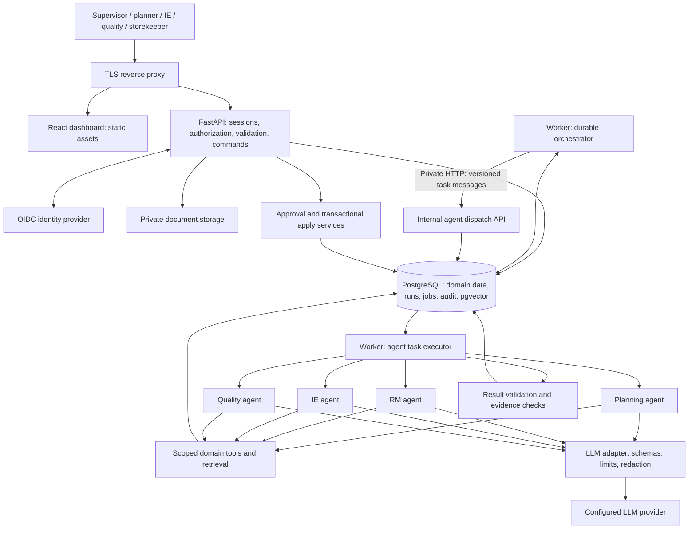

# LineSense AI

LineSense AI is a factory operations decision-support application for
apparel manufacturing, built for the IT 3041 group assignment. It helps a
supervisor answer: can this order finish on time, what is blocking it,
what evidence supports that conclusion, and what should we do next? Four
bounded AI agents — planning/allocation, raw materials (RM), industrial
engineering (IE)/cycle time, and quality — investigate an order using
scoped, read-only tools over deterministic domain calculations, produce
evidence-linked findings, and route any proposed change through a human
approval workflow before it is applied.

See [`LINESENSE_IMPLEMENTATION_PLAN.md`](LINESENSE_IMPLEMENTATION_PLAN.md)
for the full architecture and build plan, [`docs/requirements.md`](docs/requirements.md)
for numbered requirements and acceptance criteria, and
[`docs/adr/`](docs/adr/README.md) for architecture decision records.

## Architecture

One modular-monolith backend codebase and a separate durable worker
process; no per-agent microservices, no Kafka, no Kubernetes (see
[ADR-0001](docs/adr/0001-modular-monolith-and-worker.md)). `API` and
`DISPATCH` are the same application with public and private routing
boundaries; `W` (worker) and `EXEC` (agent task executor) are roles of the
same worker implementation.



## Prerequisites

- **Homebrew `postgresql@16`** (used to run a project-local cluster —
  see [ADR-0008](docs/adr/0008-local-environment-without-docker.md)):
  `brew install postgresql@16`.
- **pgvector 0.8.6**, built from source into that installation:

  ```bash
  git clone --branch v0.8.6 https://github.com/pgvector/pgvector.git
  cd pgvector
  make PG_CONFIG=$(brew --prefix postgresql@16)/bin/pg_config
  make install PG_CONFIG=$(brew --prefix postgresql@16)/bin/pg_config
  ```

- **uv** (Python package/dependency manager): `brew install uv` (Python
  3.12 is pinned by `services/backend/pyproject.toml`).
- **Node.js ≥ 20** (for the frontend, `apps/web/`, added in a later task).
- No Docker or Java is required for local development (see
  [ADR-0004](docs/adr/0004-oidc-server-sessions-and-dev-idp.md) and
  [ADR-0008](docs/adr/0008-local-environment-without-docker.md)); Compose
  and Keycloak configuration is provided for environments that have them,
  but is not verified as part of this build.

## Quick start

```bash
make bootstrap        # init the project-local PostgreSQL cluster, copy .env, uv sync
make db-start         # start the project-local cluster if it isn't running
make migrate          # apply database migrations
make test             # unit/domain tests (no database required)
make test-integration # tests against the real PostgreSQL test database
make lint              # ruff check + ruff format --check
make typecheck         # mypy
make docs-check        # verify relative links in docs/, README.md, CLAUDE.md
```

See [`CLAUDE.md`](CLAUDE.md) for the full command reference (including
commands planned for later tasks) and critical invariants.

## Setup

_Filled in as later tasks add authentication, seeding, and the frontend
dev server._

## Usage

_Filled in as later tasks add the order/analysis/approval workflow._

## Testing

_Filled in as later tasks add the full test suite (contract, E2E,
resilience, security) beyond `make test` / `make test-integration`._

## Limitations

_Filled in as hardening (Phase 5) and the assessment package (Phase 6)
record actual known issues; see `docs/IMPLEMENTATION_STATUS.md` for the
running, dated log of what has been built, tested, and verified so far._

## Contributors

| Name | Role/focus area | Contact |
|---|---|---|
| _TBD_ | _TBD_ | _TBD_ |
| _TBD_ | _TBD_ | _TBD_ |
| _TBD_ | _TBD_ | _TBD_ |
| _TBD_ | _TBD_ | _TBD_ |

## License

_TBD._
