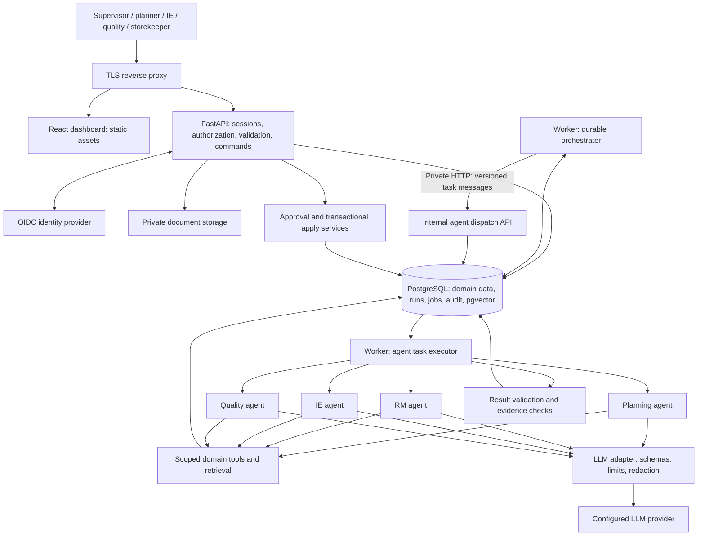

# LineSense AI

LineSense AI is a factory operations decision-support application for apparel manufacturing, built
for the IT 3041 group assignment. It answers one supervisor question — *can this order finish on
time, what is blocking it, what evidence supports that, and what should we do next?* — in one place
instead of four.

Four bounded AI agents (planning/allocation, raw materials, industrial engineering/cycle time, and
quality) investigate an order using scoped read-only tools over deterministic domain calculations,
produce evidence-linked findings, and route every proposed change through a human approval workflow
before anything is applied.

> **Read this before believing anything else in this repository.**
>
> - **No live LLM has ever run here.** No API key is configured. Every recorded run used the
>   deterministic `fixture` provider, labelled *"Test fixture — not a live AI model"* wherever a
>   provider label appears.
> - **There are no screenshots.** Browser end-to-end testing was dropped from scope.
> - **Full test suites, the full evaluation and the load test have never been run** (a machine
>   heat and workload policy forbade them). Per-task focused test runs *were* recorded, with exact
>   pass counts, in [`docs/IMPLEMENTATION_STATUS.md`](docs/IMPLEMENTATION_STATUS.md).
>
> [`docs/assessment/completion-matrix.md`](docs/assessment/completion-matrix.md) marks every
> requirement and release gate **Met / Partially met / Not verified / Not met**, with evidence. It
> is the authoritative answer to "is this done?".

## Documentation map

| If you want to… | Read |
|---|---|
| Use the application | [`docs/user-guide.md`](docs/user-guide.md) |
| See what is actually done | [`docs/assessment/completion-matrix.md`](docs/assessment/completion-matrix.md) |
| Read the project report | [`docs/report/linesense-report.pdf`](docs/report/linesense-report.pdf) |
| Work on the code | [`docs/development-guide.md`](docs/development-guide.md) |
| Understand the design | [`docs/architecture/`](docs/architecture/c4.md), [`docs/adr/`](docs/adr/README.md) |
| Check the contracts before changing anything | [`docs/architecture/backend-contracts.md`](docs/architecture/backend-contracts.md) |
| Follow the day-by-day build log | [`docs/IMPLEMENTATION_STATUS.md`](docs/IMPLEMENTATION_STATUS.md) |

## Architecture

One modular-monolith backend codebase plus a separate durable worker process. No per-agent
microservices, no Kafka, no Kubernetes ([ADR-0001](docs/adr/0001-modular-monolith-and-worker.md)).
`API` and `DISPATCH` are the same application behind public and private routing boundaries; `W`
(worker) and `EXEC` (agent task executor) are roles of the same worker implementation.



**The rule the whole design rests on:** LLMs never establish business truth and never authorize a
write. Stock, capacity, cycle-time metrics, quality eligibility and lifecycle transitions are
computed by deterministic code in `services/backend/app/domain/`
([ADR-0006](docs/adr/0006-llm-boundary-and-fixture-provider.md)).

Agents communicate over a **custom versioned HTTP/JSON protocol** (`schema_version "1.0"`) — it is
not A2A and it is not MCP ([ADR-0005](docs/adr/0005-custom-http-agent-protocol.md)).

## Prerequisites

| Requirement | Version used here | Install |
|---|---|---|
| macOS or Linux with a POSIX shell | — | — |
| PostgreSQL | 16 (Homebrew `postgresql@16`, 16.15) | `brew install postgresql@16` |
| pgvector | 0.8.6, compiled into that PostgreSQL install | see below |
| uv | 0.11.17+ | `brew install uv` |
| Python | 3.12 (pinned by `services/backend/pyproject.toml`) | installed by `uv` |
| Node.js | 26 (`apps/web/.nvmrc`); ≥ 20 works for the dev server | `brew install node` |

```bash
git clone --branch v0.8.6 https://github.com/pgvector/pgvector.git
cd pgvector
make PG_CONFIG=$(brew --prefix postgresql@16)/bin/pg_config
make install PG_CONFIG=$(brew --prefix postgresql@16)/bin/pg_config
```

**Docker is not required for local development** ([ADR-0008](docs/adr/0008-local-environment-without-docker.md)).
Compose, Caddy and Keycloak files exist under `infra/` and were validated statically
(`make infra-check`), but have never been built or run in this environment.

## Setup

From the repository root:

```bash
make bootstrap    # project-local PostgreSQL cluster on 127.0.0.1:55432, .env, uv sync
make migrate      # apply the schema (one Alembic revision)
make web-install  # npm ci in apps/web
make seed         # deterministic synthetic demo dataset + the 30-document SOP corpus
```

`make bootstrap` creates a **project-local** cluster under `.local/pgdata` on port **55432** — it
never touches your Homebrew default cluster or `brew services`. It creates the roles
`linesense_owner` (DDL) and `linesense_app` (DML only), the databases `linesense_dev`,
`linesense_test` and `linesense_eval`, and the `vector` and `pg_trgm` extensions in each.

`make seed` is idempotent, never deletes or truncates, and refuses to run when
`LS_ENVIRONMENT=production` (exit code 2). The dataset is entirely synthetic
([`docs/evaluation/synthetic-data.md`](docs/evaluation/synthetic-data.md)): 1 organization, 2
factories (`KTN`, `BYG`), 10 demo users, 26 customers, 12 styles, 20 materials, 9 lines, 540
capacity slots, 101 orders, and the `PO-DEMO-001` walkthrough order.

> **First `make seed` with documents downloads an embedding model** (`BAAI/bge-small-en-v1.5`,
> ~100 MB, into `.local/models`). That fetch has **not** been performed here. `LS_EMBEDDER=hashing`
> skips it, at the cost of a semantics-free stand-in with poor vector search results.

Settings you may want to change in `.env`:

| Variable | Default | Meaning |
|---|---|---|
| `LS_LLM_PROVIDER` | `fixture` | `fixture` = deterministic test double, no network call. `anthropic` = real provider (needs `LS_ANTHROPIC_API_KEY`). `disabled` = deterministic only |
| `LS_ANTHROPIC_MODEL` | `claude-opus-5` | Used only when the provider is `anthropic` |
| `LS_EMBEDDER` | `fastembed` | `fastembed` (real, downloads a model) or `hashing` (test stand-in) |
| `LS_DEV_IDP_PASSWORD` | `demo-password` | Shared password for the ten demo identities in the development identity provider |

## Usage

Five processes, five terminals, all from the repository root:

```bash
make db-start     # 1. database (idempotent)
make idp          # 2. development OIDC provider  -> http://127.0.0.1:8090
cd services/backend && uv run uvicorn app.main:create_app --factory --host 127.0.0.1 --port 8000
                  # 3. backend API                -> http://127.0.0.1:8000
make web-dev      # 4. frontend dev server        -> http://localhost:5173
make worker       # 5. durable worker (REQUIRED — without it, analyses stay QUEUED forever)
```

Open <http://localhost:5173> and sign in with any of the ten seeded demo identities. There is no
single `make dev` target.

Health checks:

```bash
curl http://127.0.0.1:8000/api/health/live     # {"status":"ok"}
curl http://127.0.0.1:8000/api/health/ready    # also checks the DB and reports the pgvector version
```

The end-to-end walkthrough — create an order, analyse it, read the evidence, approve, apply, place a
quality hold, release — is [`docs/user-guide.md`](docs/user-guide.md) §9–§13.

## Commands

All `make` targets, from the repository root:

| Target | What it does |
|---|---|
| `bootstrap` | Init the project-local cluster, copy `.env`, `uv sync` |
| `db-init` / `db-start` / `db-stop` | Manage the project-local cluster (port 55432) only |
| `db-reset-test` | Drop and recreate `linesense_test` (refuses any other database) |
| `migrate` | `alembic upgrade head` |
| `migration-check` | upgrade → downgrade → upgrade → `alembic check` |
| `seed` | Load the synthetic demo dataset and SOP corpus |
| `idp` | Development OIDC identity provider (development/test only) |
| `worker` | Durable worker: orchestrator, agents, documents, maintenance |
| `lint` / `format` / `typecheck` | ruff / ruff --fix / mypy + tsc |
| `test` / `test-integration` / `test-all` | Unit (no DB) / real-PostgreSQL integration / both |
| `web-install` / `web-dev` / `web-lint` / `web-typecheck` / `web-test` / `web-build` | Frontend |
| `build` | Backend app-factory import check + web production build |
| `contracts` / `contracts-check` | Export OpenAPI + protocol schemas + TS client / verify no drift |
| `datasets-check` | Validate the synthetic datasets' structural and diversity invariants |
| `docs-check` | Verify every relative link in `docs/` and `README.md` |
| `infra-check` | Static validation of Compose, images, Keycloak realm and CI (**no Docker commands**) |
| `security` | Secret scan + dependency audit + the `security`-marked test suite |
| `eval` | Full evaluation harness with the real embedder |
| `perf` | Concurrent load smoke test |
| `backup` / `restore-check` | Encrypted backup / backup + restore + three-part verification |

Backend commands run from `services/backend/` via `uv run` (Python 3.12; dependencies are added
only with `uv add`). Frontend commands run from `apps/web/` with `npm`.

**`eval`, `perf`, `test`, `test-integration`, `test-all` and `security` are heavy.** Wrap heavy
work with `scripts/heavy-job.sh <command>`, which serializes it through a lock under `.local/`. A
full command reference, including the invariants to preserve when changing code, is in
[`docs/development-guide.md`](docs/development-guide.md).

## Testing

| Layer | State |
|---|---|
| Domain unit and property tests (`app/domain/`, Hypothesis, reference fixtures) | Run per task; 78 passed on the calculation module |
| Real-PostgreSQL integration (migrations, tenancy, leases, fencing, concurrency) | Run per task; largest recorded runs 207 and 108 passed |
| Agent contract tests (invalid output, unauthorized tool, injection, budget exhaustion, stale snapshot) | Run per task |
| Frontend component tests | Whole web suite: 34 files, 123 passed |
| Resilience (real worker SIGKILL, lease expiry, reclaim, backup/restore) | Run; 0.877 s backup / 1.507 s restore + verification |
| Security (headers, rate limits, IDOR matrix, prompt injection, XSS) | Run; 81 + 27 passed |
| Browser end-to-end | **Dropped from scope** |
| Full-suite runs, `make eval` with the real embedder, `make perf` | **Never run** |

Integration tests use real PostgreSQL — never SQLite and never mocks — for locking, leases,
tenancy, migrations and concurrency. Exact commands and pass counts for every task are in
[`docs/IMPLEMENTATION_STATUS.md`](docs/IMPLEMENTATION_STATUS.md).

## Limitations

The full list, with verdicts and evidence, is
[`docs/assessment/completion-matrix.md`](docs/assessment/completion-matrix.md) §8. The ones that
matter most:

- **No live LLM run, ever.** No API key exists in this environment. The Anthropic adapter is
  unit-tested against stub SDK objects only.
- **No screenshots and no browser end-to-end coverage.** UI behaviour is verified by component
  tests against real endpoints, not by a browser.
- **No measured performance.** `make perf` was never run, so this project has no latency figure.
- **No real retrieval measurement.** The only recorded Recall@5 (0.711 against a 0.85 target) used
  a semantics-free stand-in embedder. `docs/evaluation/results/` is deliberately empty.
- **No deployment has been run.** `infra/` was validated statically; nothing was built or started.
- **Row-level security is not implemented.** Tenant isolation is application-layer plus negative
  tests, with RLS documented as a pre-pilot requirement.
- **No antivirus scanning of uploads** (structural byte/marker checks only) and **no OCR**
  (scanned PDFs are rejected with a message rather than partially parsed).
- **Vector search has no ANN index** — exact scan; fine at 30 documents, not a scale claim.
- **Rate limits are per process**; behind several API instances each enforces its own budget.
- **Notifications are in-app only**, and there is **no ERP/MES connector** — CSV import only.
- **The development identity provider is not a real IdP**: shared password, in-memory state, a
  signing key regenerated on every restart, no TLS. It refuses to run outside development/test.

## Contributors

Fill in before submission; see
[`docs/assessment/contribution-log.md`](docs/assessment/contribution-log.md) for the per-member
record and the viva declaration.

| Name | Role / focus area | Contact |
|---|---|---|
| _TBD_ | _TBD_ | _TBD_ |
| _TBD_ | _TBD_ | _TBD_ |
| _TBD_ | _TBD_ | _TBD_ |
| _TBD_ | _TBD_ | _TBD_ |

An AI coding assistant was used extensively in building this project, under human direction and
review. That is disclosed in full in
[`docs/assessment/ai-assistance-log.md`](docs/assessment/ai-assistance-log.md).

## License

_TBD._ Third-party dependency licences are inventoried in
[`docs/assessment/licenses.md`](docs/assessment/licenses.md), generated from both lockfiles. Until
a project licence is chosen, treat this repository and its synthetic datasets as coursework
material only.
