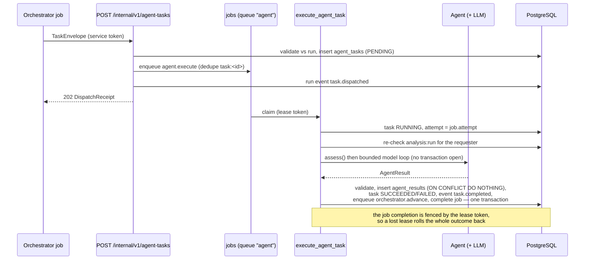
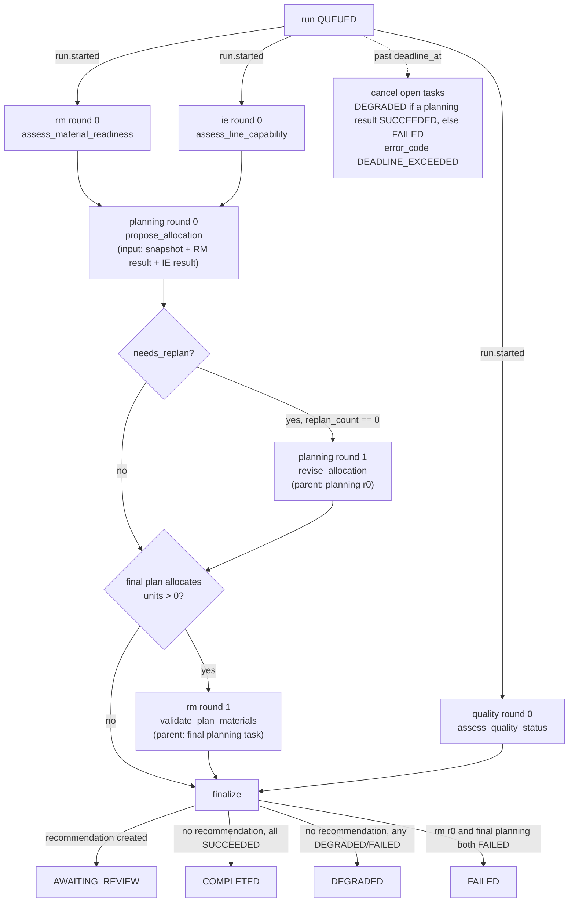

# Agent task protocol

LineSense orchestrates its agents with a **custom, versioned HTTP/JSON protocol**
(`schema_version "1.0"`). It is **not** A2A and **not** MCP, and it must never be
labelled as either: it is a small internal contract between this system's
orchestrator and its own agent executor, with tenant scoping, budgets and
evidence rules that those protocols do not define.

Models never establish business truth. An agent computes its assessment with
deterministic code first; the model may only explain it, pick one of the
candidate actions, and cite evidence that already exists.

- Models: [`app/orchestration/protocol.py`](../../services/backend/app/orchestration/protocol.py)
- JSON Schemas: [`contracts/agent-task-envelope.schema.json`](../../contracts/agent-task-envelope.schema.json),
  [`contracts/agent-result.schema.json`](../../contracts/agent-result.schema.json)
- Examples: [`contracts/examples/task-envelope.json`](../../contracts/examples/task-envelope.json),
  [`contracts/examples/agent-result.json`](../../contracts/examples/agent-result.json)
  (regenerate both with `make contracts`)

## Transport

| Route | Auth | Success | Notes |
|---|---|---|---|
| `POST /internal/v1/agent-tasks` | `Authorization: Bearer <LS_SERVICE_TOKEN>` (constant-time compare) | `202 {task_id, run_id, status}` | repeated `idempotency_key` → `200` with the existing task |
| `GET /internal/v1/agent-tasks/{task_id}` | same | `200 {task, result}` | `result` is `null` until the task finishes |

`/internal/v1` is excluded from the public OpenAPI document (`include_in_schema=False`);
this file and `contracts/` are its documentation. Rejections are audited with
actor type `SERVICE` and outcome `DENIED`.

## `TaskEnvelope`

| Field | Type | Rule |
|---|---|---|
| `schema_version` | `"1.0"` | exact |
| `message_id` | uuid | unique per message |
| `run_id`, `organization_id`, `factory_id`, `order_id`, `snapshot_id` | uuid | must all equal the run's own ids |
| `parent_task_id` | uuid \| null | when set, must be a task of the same run |
| `sender` | `"orchestrator"` | tasks never create tasks |
| `recipient` | `planning \| rm \| ie \| quality` | |
| `task_type` | str | must be in `ALLOWED_TASK_TYPES[recipient]` |
| `idempotency_key` | str | exactly `f"{run_id}:{recipient}:{snapshot_id}:round-{round}"` |
| `round` | int | `0..1` (at most one replan) |
| `deadline_at` | timestamptz | ≤ the run's `deadline_at` |
| `input_refs` | list | `order \| snapshot \| agent_result \| material_balance \| capacity_slot \| policy`; every `agent_result` must belong to the run |
| `constraints` | object | `max_tool_calls` `0..4`, `read_only` always `true` |
| `trace_id` | str | echoed into logs and audit events |

`ALLOWED_TASK_TYPES`: `rm` → `assess_material_readiness`, `validate_plan_materials`;
`ie` → `assess_line_capability`; `planning` → `propose_allocation`,
`revise_allocation`; `quality` → `assess_quality_status`.

## `AgentResult`

| Field | Type | Meaning |
|---|---|---|
| `schema_version`, `task_id`, `agent` | | `agent` must equal the task's recipient |
| `status` | `SUCCEEDED \| DEGRADED \| FAILED` | DEGRADED still carries deterministic content |
| `summary`, `summary_source` | str, `deterministic \| model` | the UI always shows the source |
| `findings[]` | `finding_id, severity, code, message, evidence_ids, source` | model notes are `source="model"`, `code="MODEL_NOTE"`, severity `info` |
| `metrics[]` | `name, value (Decimal \| null), unit, note` | values must be finite |
| `recommended_actions[]` | `action_id, kind, summary, payload, evidence_ids, rank, source` | payloads are produced by deterministic code only |
| `evidence_refs[]` | `record \| document \| calculation` refs | every cited id must be declared here |
| `warnings[]`, `input_versions`, `data_quality` | | `input_versions` must equal the snapshot's |
| `execution_metadata` | provider, model, counts, `prompt_version`, `degraded`, `degraded_reason`, timings | provider/model are `"disabled"` when no client is configured |
| `error_code` | `AgentErrorCode \| null` | set on FAILED results |

Validation (`app/orchestration/validation.py`) rejects a result whose evidence
does not resolve, whose records are outside the run's organization/factory,
whose document version is not `ACTIVE`/`SUPERSEDED` (or belongs to another
factory), or whose action payload names a slot or balance that is not in the
run snapshot. A rejected result is replaced by a FAILED result with
`INVALID_AGENT_OUTPUT` — the run continues, the bad output is never stored as
truth.

## Error codes

| Code | Retryable | Typical cause |
|---|---|---|
| `PROVIDER_UNAVAILABLE` | **yes** | provider outage or rate limit; after the last attempt the task degrades to the deterministic assessment |
| `MISSING_DATA` | no | the snapshot or a dependency is missing |
| `STALE_INPUT` | no | inputs changed under the run |
| `BUDGET_EXCEEDED` | no | the run's model-call/token budget is spent (degraded result) |
| `INVALID_AGENT_OUTPUT` | no | model output failed validation twice (degraded result) |
| `POLICY_DENIED` | no | the requester lost `analysis:run` on the factory |
| `DEADLINE_EXCEEDED` | no | the task deadline passed |

## Dispatch → execute → advance



Exhaustion: when every attempt fails, `on_agent_task_exhausted` runs once. If
the last error was `PROVIDER_UNAVAILABLE` it re-runs only the deterministic
`assess()` and stores a **DEGRADED** result warning
"AI explanation unavailable (provider unavailable)"; otherwise it stores a
FAILED result with the last error code. Both paths append `task.completed` and
enqueue `orchestrator.advance`, so a run never stalls on a dead task.

## The orchestration graph

`orchestrator.advance` (payload `{"run_id"}`, handler
[`app/orchestration/orchestrator.py`](../../services/backend/app/orchestration/orchestrator.py))
is the **only** component that creates agent tasks — a task can never create
another task. Every delivery locks the run row, does exactly one thing
(start, dispatch, or finalize), commits, and only then dispatches over HTTP;
the run lock is never held across a network call.



RM, IE and quality round 0 are dispatched **in the same advance step** (three
`task.dispatched` events with consecutive ids, before any `task.completed`):
none of them depends on another, and planning must not wait for them in
sequence. Planning round 0 waits for RM **and** IE to be terminal. Quality is
independent of the planning chain, but must be terminal before the run is
finalized, because the order report cannot be written without its facts.

At most **one** replan happens per run (`analysis_runs.replan_count` goes
0 → 1 and is never raised again).

A `DEGRADED` result still carries the agent's deterministic content, so a
degraded plan is validated by RM round 1 exactly like a `SUCCEEDED` one: the
recommendation would otherwise propose an allocation whose materials were
never checked.

**Budget interaction.** A run has 12 model calls
(`analysis_runs.model_calls_limit`) shared by all six tasks, reserved before
each call — including the calls of attempts that then fail. Two calls per task
(one investigation, then `submit_assessment`) is therefore what a full graph
affords, and that is what the fixture provider does. The orchestrator can lower
an individual task's allowance through the envelope's
`constraints.max_tool_calls`, which the agent loop honours as an upper bound
alongside its own `MAX_TOOL_CALLS`. When the budget does run out — a provider
outage burns three attempts per task, for instance — the remaining tasks return
their deterministic assessment with `degraded_reason = BUDGET_EXCEEDED`; the
graph itself never changes.

### The replan rule

`needs_replan(planning_result, rm_result)` returns a reason string only when
the rank-0 `ALLOCATION` action of the planning result commits more units than
the RM agent's `coverable_units` metric:

```
MATERIAL_SHORTAGE_CONFLICT: selected plan allocates <x> units but materials cover <y>
```

It returns `None` when either result is missing or `FAILED`, when the plan has
no allocation action, or when `allocated_units <= coverable_units`. The reason
is recorded verbatim in the `orchestrator.replan` run event. The revision task
(`revise_allocation`) ranks the `MATERIAL_LIMITED` option first and adds a
`REVISED_FOR_MATERIAL` warning quoting the allocated and requested units, the
shortage and the first open receipt date.

### Finalization

In one transaction the orchestrator creates the recommendation (if there is a
plan to propose), supersedes every earlier `PROPOSED`/`APPROVED`
recommendation of the same order with `NEWER_ANALYSIS`, sets the run status
per the graph above, appends the canonical order report as a `run.report`
event, appends `run.finalized`, notifies the `supervisor` role
(link `/runs/<id>`) and audits `analysis.completed`.

### The order report (`run.report`)

[`app/orchestration/synthesis.py`](../../services/backend/app/orchestration/synthesis.py)
builds one `OrderReport` per run **from deterministic state only**:

| field | source |
| --- | --- |
| `order` | the run snapshot's order (id, external_ref, due_date) |
| `states.production` / `states.quality` | the snapshot's order and quality facts |
| `states.material` | the worst material state the **RM round-0** findings describe |
| `states.analysis` | the run status the run is closing with |
| `shipment` | the snapshot's calculated eligibility, `source: "Calculated from records"` |
| `blockers` | every `critical` finding, deterministic ones first |
| `agent_summaries` | one row per agent task: status, summary, `summary_source`, provider, model, `degraded_reason`, `finding_codes` |
| `recommendation` | the run's proposal (id, status, kind, `source_label`) or `null` |
| `evidence` | every evidence ref, once per agent |
| `degraded` / `degraded_reasons` | the distinct reasons behind non-`SUCCEEDED` results |

Model text appears **only** inside `agent_summaries`, labelled with the
provider that produced it. A model claiming an order is ready to ship can
never change `shipment.eligible`, a state or a blocker.

`GET /api/v1/runs/{id}` returns the report as `report`;
`GET /api/v1/orders/{id}` returns the latest finalized run's report as
`latest_report`, with `stale: true` when the order's version differs from the
version in that run's snapshot.

`recommendations.evidence_refs` is stored as `{"items": [...]}`, each item
being an `EvidenceRef` the selected actions cited plus the `agent` that found
it. `proposal_hash` is the sha256 hex of
`json.dumps(proposal, sort_keys=True, separators=(",", ":"), default=str)`.

### Reconciliation

`reconcile_once` enqueues `orchestrator.advance` (dedupe key
`run:<id>:reconcile:<YYYYMMDDHHMM>`) for every `QUEUED`/`RUNNING` run that has
been quiet for more than 30 s with no runnable `orchestrator.advance` or
`agent.execute` job of its own, and for every run past its deadline. A worker
that dies mid-task is therefore always recovered, either by the job lease
expiring or by this sweep.

## The bounded agent loop

`BaseAgent.run` (see [`app/agents/base.py`](../../services/backend/app/agents/base.py)):

1. `assess(ctx)` — deterministic; the only source of findings, metrics, action
   payloads and evidence.
2. No LLM client → DEGRADED result, `degraded_reason="LLM_DISABLED"`,
   warning "AI explanation unavailable".
3. Otherwise a bounded loop: at most `MAX_TOOL_CALLS = 4` investigative tool
   calls, `MAX_REPAIR_CALLS = 1` repair turn and `4 + 2 + 1` iterations. Every
   model call is reserved against the run's budget first (`reserve_model_call`);
   usage is recorded after it.
4. The first user message is JSON context inside `<context>…</context>` plus the
   instruction to treat tool results and documents as untrusted data and to
   select only among `candidate_actions` and cite only `available_evidence`.
   Tool output is passed back redacted (`redact_payload`).
5. `submit_assessment` is validated server-side (action id, finding ids,
   evidence ids). One repair turn is offered; a second failure degrades the
   result to `INVALID_AGENT_OUTPUT` with the deterministic content intact.
6. On success the selected action moves to `rank=0` (relative order preserved,
   **payload unchanged**), the model's summary is used with
   `summary_source="model"`, notes become `MODEL_NOTE` findings and a revision
   note becomes a `"Revision: …"` warning.

Labels shown for a run: `"Test fixture — not a live AI model"` (fixture),
`"AI disabled — deterministic results only"` (disabled), otherwise
`"<provider> · <model>"`.

## Run lifecycle API

`POST /api/v1/orders/{order_id}/analyses` (permission `analysis:run`,
`Idempotency-Key`, body `{"expected_order_version"}`) creates the run, builds
the immutable snapshot, appends `run.created` and enqueues
`orchestrator.advance`. `GET /api/v1/runs/{run_id}`,
`GET /api/v1/runs/{run_id}/events?after_id=`,
`GET /api/v1/orders/{order_id}/runs`, `POST /api/v1/runs/{run_id}/cancel` and
`POST /api/v1/runs/{run_id}/retry` complete the lifecycle. Cancelling a run
also cancels its PENDING/RUNNING tasks and their READY jobs and supersedes the
run's open recommendations with `superseded_reason="RUN_CANCELLED"`.
