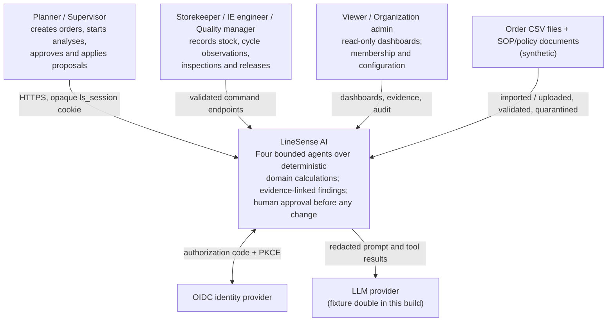
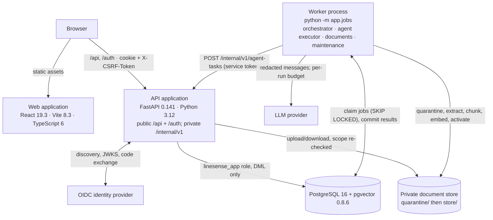

# C4 views

Three levels, each drawn twice: as a Mermaid diagram here (readable in the
repository) and as a TikZ diagram in the LaTeX report
(`docs/report/diagrams/d1-c4-context.tex`, `d2-c4-container.tex`,
`d3-component-view.tex`). The two must agree; when they disagree, the code is
the tie-breaker and both are wrong until fixed.

## Level 1 — system context

## Level 2 — containers

`API` and the internal dispatch endpoint are the **same application** with a
public and a private routing boundary. The worker is the **same deployable
image** with a different entrypoint. Neither fact is an implementation detail
that could quietly change: the OpenAPI document excludes `/internal/v1`, and the
Dockerfile has one build with three entrypoint modes.

**Boundaries that are enforced, not just drawn.** The browser can reach neither
the database, nor a provider key, nor `/internal/v1` (excluded from the public
OpenAPI document, protected by a constant-time-compared bearer service token,
and returned as 404 at the edge by the reverse proxy as an independent control).
Agents receive read/compute tools over an immutable run snapshot — never SQL,
never a shell, never a URL. Only the domain command services write business
rows.

## Level 3 — components

Dependency layers inside the backend. The rule is one-directional: **a lower
layer never imports a higher one**, and `app/domain/*/calc.py` imports nothing
from the rest of the application at all.

| Layer | Modules | Responsibility |
|---|---|---|
| HTTP | `app/api/*.py` routers + `app/api/schemas` | route definitions, request/response models, OpenAPI |
| Request cross-cutting | `app/auth` (policy, scope, sessions, oidc, csrf), `app/idempotency`, `app/audit`, `app/api/{middleware,ratelimit,errors,deps}` | authenticate, resolve scope, claim the idempotency key, audit every privileged write and denial |
| Domain services | `app/domain/{orders,planning,capacity,inventory,ie,quality,approvals}` | the only components that write business rows; the deterministic lock order |
| Pure calculations | `app/domain/*/calc.py`, `rounding.py`, `orders/lifecycle.py`, `vocab.py` | `Decimal` in, `Decimal` out; no database, no I/O, no model |
| Orchestration | `app/orchestration/{protocol,snapshot,dispatch,orchestrator,executor,validation,synthesis,recommendations,events}` | the only component that creates agent tasks |
| Agents | `app/agents/base.py` + `rm`, `ie`, `quality`, `planning`, `prompts/` | the bounded observe–choose–evaluate loop |
| Capability | `app/llm`, `app/retrieval`, `app/nlp` | model boundary, hybrid retrieval, entity/classification/summaries |
| Infrastructure | `app/jobs` (queue, worker, handlers, reconcile), `app/db`, `app/settings`, `app/logging` | durable jobs, 50 tables, configuration, structured logging |
| Development/CI only | `app/seed`, `app/evaluation`, `devtools/dev_oidc` | never part of the runtime container image |

Two connectors skip a layer and are drawn as such in the TikZ version: the HTTP
layer enqueues jobs directly (analysis creation, document upload) with a
`dedupe_key`, and the worker runtime invokes the registered orchestration
handlers with completion fenced by the lease token.

## See also

- [`agent-protocol.md`](agent-protocol.md) — the task/result contract and the orchestration graph
- [`agents.md`](agents.md) — what each agent may and may not do
- [`state-machines.md`](state-machines.md) — every state vocabulary in one place
- [`sequence-analysis.md`](sequence-analysis.md) — the end-to-end run, step by step
- [`erd.md`](erd.md) — the 50-table entity-relationship diagram
