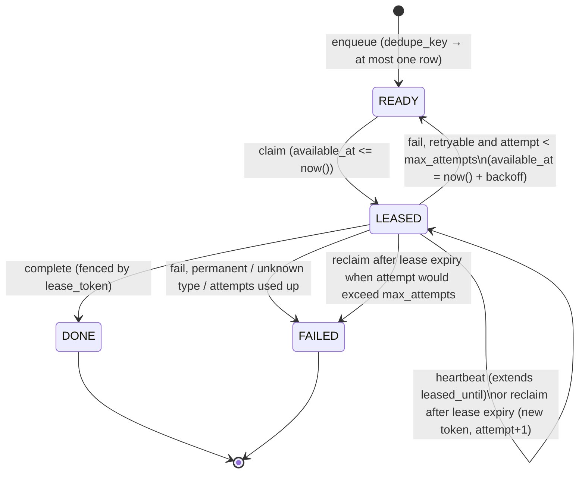

# Durable jobs

LineSense runs background work (orchestration, agent tasks, document processing, maintenance)
through a job queue stored in PostgreSQL, in the `jobs` table. There is no separate broker. The
binding interface is in [backend-contracts.md §7](backend-contracts.md#7-durable-jobs-appjobsqueuepy).
The code is in `services/backend/app/jobs/`:

| Module | Responsibility |
| --- | --- |
| `queue.py` | `enqueue`, `claim`, `heartbeat`, `complete`, `fail`, `ClaimedJob`, the error types, and the backoff |
| `worker.py` | `Worker`, `HandlerRegistry`, `JobContext`, `finish_in_transaction` |
| `handlers.py` | `build_registry(settings)`: registers every job type the worker runs |
| `reconcile.py` | `reconcile_once`: expires idempotency keys and overdue recommendations |
| `__main__.py` | `python -m app.jobs` (`make worker`): signal handling and CLI |

Queues: `orchestrator`, `agent`, `document`, `maintenance`.

## States



`CANCELLED` exists in the schema for later tasks. No code path in Task 10 sets it.

## Claiming

`claim` is a single statement:

```sql
UPDATE jobs SET status = 'LEASED', lease_token = :fresh, worker_id = :worker,
       attempt = attempt + 1, leased_until = now() + :lease, heartbeat_at = now()
WHERE id = (
  SELECT id FROM jobs
  WHERE queue IN (:queues)
    AND ((status = 'READY'  AND available_at <= now())
      OR (status = 'LEASED' AND leased_until  <  now()))
  ORDER BY available_at, created_at
  LIMIT 1
  FOR UPDATE SKIP LOCKED)
RETURNING id, queue, job_type, payload, attempt, max_attempts, lease_token
```

Because of `SKIP LOCKED`, concurrent claimers never block each other and never claim the same row.
All lease times use the database clock. If a reclaimed job's `attempt` is now greater than
`max_attempts`, the same transaction marks it `FAILED` with `last_error = 'attempts exhausted after
lease expiry'` and sets `attempt` back to `max_attempts`. After the commit, the job type's
`on_exhausted` hook runs and the claim is tried again.

## Leases, heartbeats and fencing

- While a handler runs, the worker calls `heartbeat` every `heartbeat_seconds` (default 10 s;
  the lease lasts 30 s). A heartbeat only succeeds if the row is still `LEASED` with the
  worker's `lease_token`.
- If a heartbeat returns `False`, the lease was lost. The worker cancels the handler task
  (`asyncio.Task.cancel`) and logs `job.lease_lost`. It does **not** mark the job failed, because
  the job now belongs to whichever worker holds the new lease.
- Handlers make their business writes and call `finish_in_transaction(ctx, session)` in the
  **same transaction**. That call runs `complete`, which is fenced by `lease_token` and
  `status = 'LEASED'`. If the lease is gone, it raises `LeaseLostError`, so the handler's writes
  roll back with it.
- If a handler returns without completing the job, the worker completes it in a fresh fenced
  transaction. If that returns `False`, the worker checks whether the row is already `DONE` under
  its own token (the handler completed it). Otherwise it logs `job.lease_lost`.
- `fail` is fenced the same way. A stale token changes nothing.

## Failures and retries

| Handler outcome | Result |
| --- | --- |
| returns | `DONE` |
| `PermanentJobError`, or no handler registered for the type | `FAILED`, then `on_exhausted` runs |
| any other exception (including `RetryableJobError`) | `READY` after backoff if `attempt < max_attempts`, otherwise `FAILED` and `on_exhausted` runs |
| lease lost | unchanged (the new lease holder owns the job) |

Backoff is `min(2 ** attempt * 2, 60)` seconds plus up to 1 s of jitter. The error text stored in
`last_error` is `repr(type(exc).__name__) + ': ' + str(exc)[:500]`, capped at 2,000 characters.
It never includes tracebacks or local variables.

## Worker runtime

`python -m app.jobs --queues orchestrator,agent,document,maintenance --concurrency 4` (or
`make worker`) does the following:

- Runs `concurrency` asyncio slots. Each slot claims and processes one job at a time.
- Runs `reconcile_once` every 15 s. It is idempotent, so several workers can run it safely.
- On SIGINT/SIGTERM, stops claiming and gives running handlers up to 20 s to finish. Handlers
  still running after that are cancelled. Their jobs stay `LEASED` and are recovered when the
  lease expires.
- Logs `job.claimed`, `job.completed`, `job.failed` and `job.lease_lost` with the job id, type and
  attempt, plus `worker.alive` every 30 s.
- Outside production, touches `.local/worker-<id>.alive` on every loop (the directory is set by
  `LS_WORKER_ALIVE_DIR`, relative to `services/backend`) and removes the file on shutdown. No
  table stores worker liveness.

## Delivery guarantee: at least once

A job can run more than once. For example, a worker can finish its side effects outside the
database, then lose its lease before committing. Handlers must be idempotent:

- Put database writes and `finish_in_transaction` in one transaction. Fencing then ensures that
  at most one attempt's database writes commit.
- Key any external side effect (LLM calls, files) on the job id or on a business idempotency key,
  and make it safe to repeat.
- Use `dedupe_key` when enqueuing, so that a repeated request does not create a second job.

## Reconciliation (initial scope)

`reconcile_once(session_factory, settings, *, now=None)` makes these changes in one transaction:

- deletes `idempotency_keys` whose `expires_at <= now`
- marks `recommendations` in `PROPOSED`/`APPROVED` whose `expires_at <= now` as `EXPIRED`,
  increments `version`, and writes a `SYSTEM` audit event (`recommendation.expire`) for each row.
  Rows locked by a concurrent decision are skipped (`SKIP LOCKED`) and picked up in a later round.

Task 13 adds more reconciliation steps.
