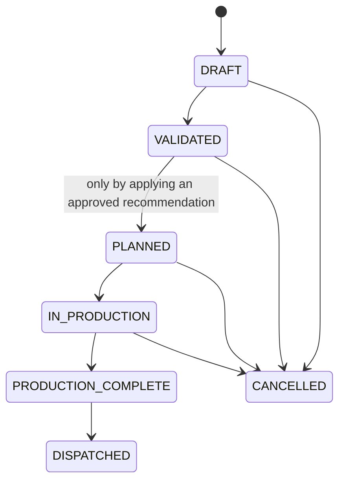
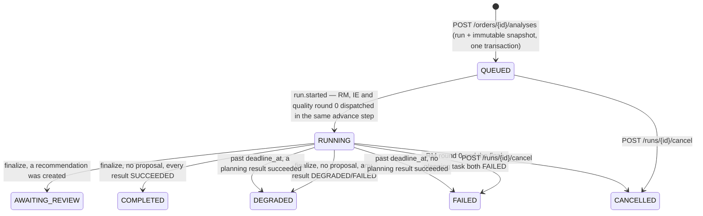
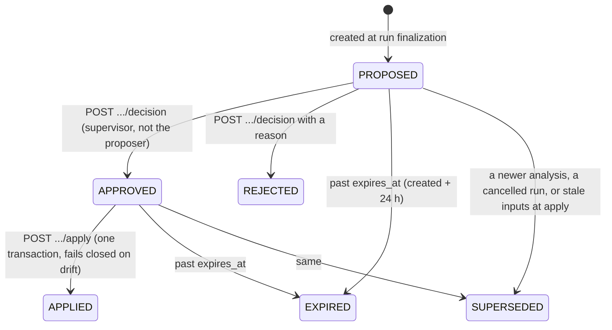

# State machines

Five separate state vocabularies. They are kept separate deliberately: merging
them is exactly how a single misleading "order status" gets invented, and the
specification calls that out as a defect of the original design.

TikZ versions of the run and job machines are in the report
(`docs/report/diagrams/d5-run-state-machine.tex`,
`d9-job-state-machine.tex`).

## 1. Production lifecycle (`orders.production_state`)



Every transition is defined in one central policy table
(`app/domain/orders/lifecycle.py::TRANSITIONS`) with actor permissions,
preconditions and audit requirements. **There is no `PATCH status` endpoint.**
An invalid transition returns `409 INVALID_TRANSITION`, never a silent no-op.

`VALIDATED → PLANNED` is explicitly blocked at the order endpoint even though it
is a real transition in the table: planning is applied only through an approved
recommendation (`409`, "Planning is applied through an approved
recommendation."). Cancellation releases the order's active allocations and
reservations through the shared lock-ordered helpers and enqueues a
`maintenance.refresh_material_states` job for the other orders sharing those
materials.

## 2. Material state (`orders.material_state`)

`UNKNOWN | READY | AT_RISK | SHORTAGE`

Derived, never set by hand and never by a model. `app.domain.inventory.calc`
computes it per BOM line from `available_now`, `gross_demand`, `shortage` and
the eligible receipts by the demand date; the **most severe** line wins. A
`DRAFT` order keeps `UNKNOWN` (no planning has happened). An overdue order's
demand is dated at `min(as_of, due_date)`, so it reports `SHORTAGE` rather than
`AT_RISK`.

Recomputation is bounded (at most 500 orders per command) and always happens
under the correct lock order — a storekeeper command passes the order ids it
already locked, and the recompute never locks an order it was not given.

## 3. Quality state (`orders.quality_state`) and shipment eligibility

`NOT_INSPECTED | PENDING | HOLD | RELEASED`

`shipment_ready` is **derived** and is not a stored column of truth:

```
production_complete
  AND required current inspections satisfied
  AND no active hold
  AND packing/quantity records complete
  AND an authorized quality release recorded
```

Reason codes when it is false: `POLICY_UNKNOWN`, `PRODUCTION_NOT_COMPLETE`,
`PACKING_INCOMPLETE`, `INSPECTION_MISSING:<TYPE>`, `ACTIVE_QUALITY_HOLD`,
`NO_QUALITY_RELEASE`. Zero inspections yields *unknown*, never *pass*.
`tests/agents/test_quality_agent.py::test_a_model_all_clear_never_makes_the_shipment_eligible`
drives a scripted model that says "All clear — ready to ship" and asserts that
neither the findings, the metric, nor `report.shipment.eligible` change.

## 4. Analysis run (`analysis_runs.status`)



Every delivery of `orchestrator.advance` locks the run row, does **exactly one
thing** (start, dispatch, or finalize), commits, and only then makes a network
call — the run lock is never held across the wire. Cancelling also cancels the
run's `PENDING`/`RUNNING` tasks and their `READY` jobs and supersedes its open
recommendations with `superseded_reason = "RUN_CANCELLED"`.
`POST /runs/{id}/retry` is accepted on any terminal state and starts a **new**
run from a fresh snapshot; it never resurrects the row.

## 5. Recommendation (`recommendations.status`)



`DRAFT` exists in the vocabulary and is not used by any current code path.
Expiry is applied by `reconcile_once` (with `SKIP LOCKED`, a `version` increment
and a `SYSTEM` `recommendation.expire` audit event) and also checked
synchronously on decide and apply. The full rule set is in
[`../security/approval-integrity.md`](../security/approval-integrity.md).

## 6. Agent task (`agent_tasks.status`) and job (`jobs.status`)

Task: `PENDING → RUNNING → SUCCEEDED | FAILED | CANCELLED`. A task never
creates another task; only the orchestrator creates tasks.

Job:

```mermaid
stateDiagram-v2
    [*] --> READY: enqueue (a dedupe_key yields at most one row)
    READY --> LEASED: claim (UPDATE ... FOR UPDATE SKIP LOCKED, fresh lease_token, attempt+1)
    LEASED --> DONE: complete, fenced by lease_token AND status='LEASED'
    LEASED --> READY: retryable failure, attempt < max_attempts, available_at = now() + backoff
    LEASED --> FAILED: PermanentJobError, unregistered type, or attempts used up
    LEASED --> LEASED: heartbeat extends leased_until; an expired lease is reclaimed with a new token
```



Backoff is `min(2 ** attempt * 2, 60)` seconds plus up to 1 s of jitter.
Delivery is **at least once** and is documented as such — never exactly-once.
`CANCELLED` exists in the `jobs` schema and is set by no code path. Full detail:
[`jobs.md`](jobs.md).

## 7. Document version (`document_versions.status`)

`QUARANTINE → PROCESSING → ACTIVE | REJECTED`, and `ACTIVE → SUPERSEDED` when a
newer version of the same document activates. At most one version of a document
is `ACTIVE` at a time, enforced in the activation transaction. See
[`retrieval.md`](retrieval.md).
